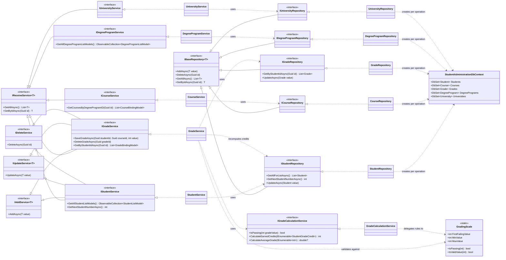

# Student Administration — Code Showcase

A layered **.NET 9 / MAUI** desktop application for managing students, grades, courses, degree programs and universities.

> **This repository is a curated code sample, not a runnable project.**
> It contains the source files that are worth reading — architecture, business logic, data access and tests. Build artifacts, resource files, EF Core migrations and configuration secrets are intentionally left out (see [What is not in this repository](#what-is-not-in-this-repository)). If you are here to review code, the [Reading Guide](#reading-guide) points you at the parts worth your time.

---

## Table of Contents

- [Demo](#demo)
- [What the application does](#what-the-application-does)
- [Tech Stack](#tech-stack)
- [Architecture](#architecture)
- [Reading Guide](#reading-guide)
- [Engineering Decisions](#engineering-decisions)
- [Testing](#testing)
- [Project Structure](#project-structure)
- [What is not in this repository](#what-is-not-in-this-repository)
- [Known Limitations](#known-limitations)
- [Class Diagram](#class-diagram)

---

## Demo

<p align="center">
  <a href="https://youtu.be/iz5YZ8q-z4g">
    
  </a>
</p>

<p align="center"><em>Two-minute walkthrough of the running application.</em></p>

---

## What the application does

- **Student management** — create, edit and delete students, with automatically assigned, collision-free student numbers
- **Filtering** — filter the student list by student number, first name, last name and degree program
- **Grades** — record one grade per student and course, with the earned credits and grade average recalculated on every change
- **Master data** — degree programs, courses and universities
- **Localized UI** — all display strings come from `.resx` resources
- **Diagnostics** — structured logging to daily rolling log files

---

## Tech Stack

| Area | Technology |
|---|---|
| Framework | .NET 9 · .NET MAUI 9 (`net9.0-windows10.0.19041.0`) |
| Data access | Entity Framework Core 9, SQL Server provider |
| MVVM | CommunityToolkit.Mvvm 8.4 (source generators) |
| UI components | CommunityToolkit.Maui 12.3, Syncfusion.Maui 32.1 (DataGrid, Inputs, Popup, RadialMenu) |
| Logging | Serilog 4.3 (rolling file sink) |
| Testing | xUnit v3, FluentAssertions, coverlet |

The single target framework is deliberate: MAUI was chosen for its XAML/MVVM tooling and the Syncfusion control set, but the app is only built and tested for Windows desktop. Adding further target frameworks would claim a portability the project has never verified.

---

## Architecture

Three projects with a strict one-directional dependency chain, wired together by dependency injection in `MauiProgram.cs`. Each layer exposes its own DI extension method (`AddDataBaseRepositories()`, `AddServices()`), so registration stays next to the code it registers.

```
StudentAdministration.UI            .NET MAUI app — views, view models, DI composition root
        │  depends on
        ▼
StudentAdministrationServices       Business logic, binding/list models, entity mapping
        │  depends on
        ▼
StudentAdministrationDatabase       EF Core DbContext, entities, repositories
```

`StudentAdministration.UnitTests` references the service layer and tests it against hand-written repository doubles.

**Model boundaries.** Entities (`Student`, `Grade`, …) never reach the UI. The service layer maps them to *binding models* for detail/edit screens and to leaner *list models* for grid rows. `EntityMappings` holds the conversions in one place — explicit and compile-time-checked rather than convention-based.

**Interface segregation.** Instead of one fat `ICrudService<T>`, capabilities are split into `IReceiveService<T>`, `IAddService<T>`, `IUpdateService<T>` and `IDeleteService`. A service composes only what it actually supports: `ICourseService` is read-only, `IGradeService` is full CRUD. Consumers cannot call an operation the service does not implement.

---

## Engineering Decisions

The parts of this project that involved an actual trade-off. Each decision is also documented at the relevant place in the source.

### A context factory instead of a scoped `DbContext`

MAUI has no per-request scope. A scoped or singleton `DbContext` would effectively live for the entire application lifetime: its change tracker grows unbounded, and it is not safe for concurrent async calls. Every repository therefore takes an `IDbContextFactory<StudentAdministrationDbContext>` and creates a short-lived context per operation.

### Two query paths instead of one

`GetAllAsync()` eagerly loads the full graph — degree program, university, grades and their courses — for detail views. `GetAllForListAsync()` loads only the degree program for the grid. Serving the list from the full-graph query would mean a Cartesian product across grades and courses on every screen refresh, for data the grid never displays.

### Business rules enforced at the database level

- `Student.StudentNumber` has a unique index. It is a natural key and duplicates must be impossible, not merely unlikely.
- `Grade` has a unique index on `(StudentId, CourseId)`. The whole credit calculation assumes at most one grade per student and course; the schema now guarantees what the code already relied on.
- Deleting a student cascades to their grades; deleting a university or a course that grades reference is restricted.

### Credits are recomputed, never adjusted

Every grade write and delete recalculates the student's credits from *all* of their passing grades and persists the result. The obvious alternative — adding or subtracting the affected course's credits — silently drifts as soon as a grade changes from passing to failing, or a delete is missed. Recomputation makes an incorrect total unreachable rather than merely unlikely.

### One grading scale, one place

`GradingScale` is a static class holding the passing threshold and the valid range. Grade validity is checked in `GradeService` before any write, because EF Core does **not** evaluate `[Range]` data annotations on save — the annotation documents the intent, the service enforces it. Previously the same literals and `IsPassing` logic existed on the entity, on the binding model and inline in view models.

### A projection type for the credit calculation

`StudentGradeCredit` is a `readonly record struct` pairing a grade value with a course's credit value. `GradeCalculationService` operates on that instead of on `Grade` entities, so the calculation does not depend on the `Course` navigation property being loaded, and it can be tested without any EF Core involvement at all.

### Sequential student numbers instead of random ones

`GetNextStudentNumberAsync()` queries the current maximum and returns the next value. The earlier random generation could — and eventually would — produce a duplicate.

### Explicit mapping instead of AutoMapper

Entity ↔ model conversions live in `EntityMappings` as plain extension methods. A new property that is not mapped is a visible omission in a readable file rather than a silently missing value at runtime. The project is small enough that the boilerplate is a fair price for that.

### Hand-written test doubles instead of a mocking framework

The repository and service doubles in `StudentAdministration.UnitTests/MockData/` are ordinary classes backed by in-memory lists. They keep the test bodies free of setup ceremony, and — for the credit logic in particular — let a test assert on *state after the operation* rather than on which methods were called.

### Operational details

- **Logging** — Serilog writes to a daily rolling file with a seven-day retention limit, at `Warning` level and above so log volume stays useful in production. Debug output is added only in `DEBUG` builds.
- **Startup migration** — `db.Database.Migrate()` runs at startup inside a `try/catch` that logs the failure as `Fatal` and rethrows. A database that failed to migrate must not be papered over by an application that starts anyway.
- **Dependency auditing** — `NuGetAudit` is enabled with `NuGetAuditMode=all` at `NuGetAuditLevel=low`, so vulnerabilities in transitive packages surface at build time rather than in a later security review.
- **Configuration** — connection string and Syncfusion license key are read from an embedded `appsettings.json` that is git-ignored. `appsettings_Template.json` documents the expected shape.

---

## Testing

32 tests across six test classes covering the service layer:

| Test class | Focus |
|---|---|
| `GradeServiceUnitTest` | Create-or-update semantics, credit recalculation, delete behaviour |
| `GradeCalculationServiceUnitTest` | Passing rules, credit sums, average with an empty set |
| `StudentServiceUnitTest` | CRUD, list projection, next student number |
| `CourseServiceUnitTest` · `DegreeProgramServiceUnitTest` · `UniversityServiceUnitTest` | Read paths and mapping |

Tests target behaviour, not implementation: they assert what the persisted state looks like after an operation. Edge cases are covered deliberately — an average over zero grades returns `null` rather than throwing, and an out-of-range grade value is rejected before it reaches the repository.

Repositories and view models are not unit-tested. Repository tests here would mostly assert that EF Core works, and the view models are thin enough that the value would not justify a UI test harness.

---

## Project Structure

```
.
├── StudentAdministration.UI/
│   ├── Views/                          # MainPage, AddEditStudentPage, AddGradePage, DetailsPage (XAML)
│   ├── ViewModel/                      # View models + their interfaces
│   ├── Helper/                         # Navigation parameter helper
│   ├── MauiProgram.cs                  # Composition root
│   └── appsettings_Template.json       # Shape of the git-ignored appsettings.json
│
├── StudentAdministrationServices/
│   ├── Services/                       # Business logic + segregated interfaces
│   ├── Models/                         # Binding models (detail/edit) and list models (grid)
│   ├── Mapping/EntityMappings.cs       # Entity ↔ model conversions
│   └── Extensions/                     # DI registration
│
├── StudentAdministrationDatabase/
│   ├── Database/                       # DbContext + design-time factory
│   ├── Models/                         # Entities, base models, GradingScale
│   ├── Repositories/                   # Repositories + interfaces
│   └── Extensions/                     # DI registration
│
└── StudentAdministration.UnitTests/
    ├── Services/                       # xUnit test classes
    └── MockData/                       # Hand-written repository/service doubles + sample data
```

---

## What is not in this repository

Removed to keep the sample focused on code that is worth reviewing:

- `Resources/` (fonts, images, app icon, splash screen, `AppResources.resx` localization files) — referenced by the csproj and view models, but of no review value
- `StudentAdministrationDatabase/SampleData/` — seed data classes referenced by `OnModelCreating`
- `Migrations/` — generated EF Core migrations
- `appsettings.json` — contains the connection string and Syncfusion license key

As a result the solution **does not compile as checked in**, by design. Restoring the four items above and supplying a valid `appsettings.json` and a reachable SQL Server instance is all that separates it from a working build.

---

## Known Limitations

Honest scope boundaries rather than oversights:

- **Windows only.** The MAUI abstraction is in place, but no other target framework is built or tested.
- **No repository or UI test coverage.** See [Testing](#testing) for the reasoning.
- **`GetAllAsync()` loads every student with the full graph.** Fine for the data volumes this project targets; paging or projected queries would be the first change under real load.
- **Master data is read-only in the UI.** Degree programs, courses and universities are seeded, not managed in-app.
- **Concurrency is unhandled.** There is no optimistic concurrency token, so a last-write-wins conflict is possible if two clients edit the same student. A single-user desktop application makes this acceptable; a shared deployment would not.

---

## Class Diagram


